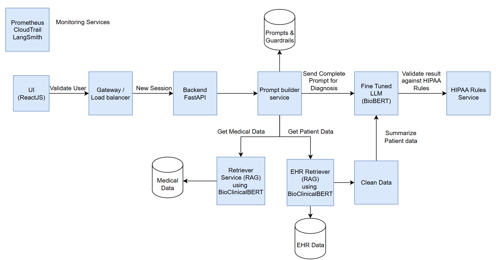

# Healthcare Diagnoses System
# Scenario

A healthcare client wants a secure AI assistant for doctors that:
Summarizes patient history from EHR notes.
Suggests possible diagnoses based on symptoms.
Must comply with HIPAA and store no PHI outside their cloud.

# Tasks

Draw a high-level architecture diagram (components, data flow, and security layers).
Recommend a technology stack (LLM, RAG framework, cloud infrastructure, etc.).
Describe three key trade-offs in your design (e.g., accuracy vs. latency, open-source vs.
closed-source models).

# Deliverable

Architecture diagram.
Tech stack description.
Trade-off analysis.

## Architecture Diagram

## Technology  Stack 

- AWS
    - Amazon Elastic Kubernetes Service
    - Amazon API Gateway
    - Istio
- ReactJS frontend with FastAPI backend
- Pinecone (for EHR and diagnostic data)
- prompt builder (api to build out the prompts using the retriever service and pre defined system and user prompts)
- LLM (local llm fine tuned on medical data)
- retriever for medical diagnosis and EHR notes
    - guardrails to filter out PHI
    - guardrails for HIPAA compliance
    - metadata
    - rerank for large data
- Prometheus for telemetry
- CloudTrail, GuardDuty, and Langsmith for monitoring services

## Trade-Off Analysis

- Accuracy vs Latency
    Accuracy is critical for diagnosis but will require more time to retrieve and validate results. Waiting too much time will make the system unusable in time sensitive situations so latency must be considered. One solution is to include multiple paths for different diagnosis. More complex situations will require more data analysis and time to diagnose while simple cases can use a much smaller and faster LLM for immediate feedback.
- Privacy vs innovation
    Privacy is critical in the medical field but requires more complexity to implement. To ensure privacy systems need to limit access and routinely tested for security risks. This takes a considerable amount of resources and can greatly reduce the freedom for innovation. For example every time you want to integrate a new LLM model a privacy assessment will need to be completed before proceeding. In some cases the LLM may not fit the criteria and you will be unable to use it.
- Open-souce vs Closed-source models
    Open source provides transparency into how the model weights work and how fine tuning them could change the outcome. This can be beneficial if you have the expertise to fine tune a model. A closed source model doesn't expose the inner workings but is maintained by providers for greater access, performance, and doesn't require expertise to use.
- Fine tune vs RAG
- Database selection (Pinecone vs Weaviate): 
    - Pinecone is fully managed so easier to deploy and performant for real-time applications
    - Weaviate give more control and GraphQL for better hybrid searching on complex medical data.